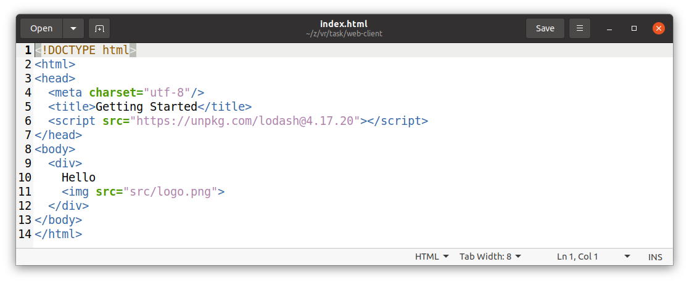

#Web client

_Template for web client_

## Step 1 -- Clone

1. Clone to your local machine: `git clone  https://github.com/it-zmina/web-client.git`
2. Create empty repository in your Git Hub account with name `web-client`.
3. Insert your data to the `git_settings.sh` script.
4. Invoke `git_settings.sh` script in your Git Bash console: `./git_settings.sh`
5. Set path to your repository: `git remote set-url origin <path to your repository>`
6. Push to your repository: `git push origin master`
7. Check that code successfully deployed to your repository.

## Step 2 -- Add image to web document
1. Insert `img`-tag to the `index.html`: 

## Step 3 -- Output text programmatically
1. Remove plain web tags from `index.html` and add script to the `body`: 
2. Add `div` tag with text programmatically using `index.js` script: 

## Step 4 -- Add image programmatically
1. Add image to `div` tag programmatically using `index.js` script:  